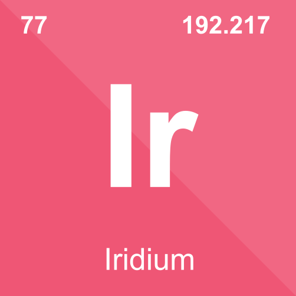
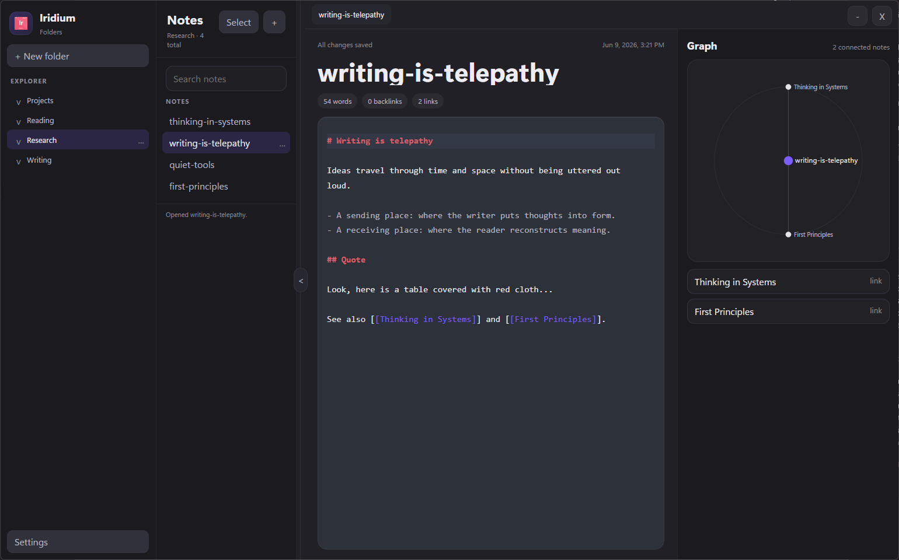
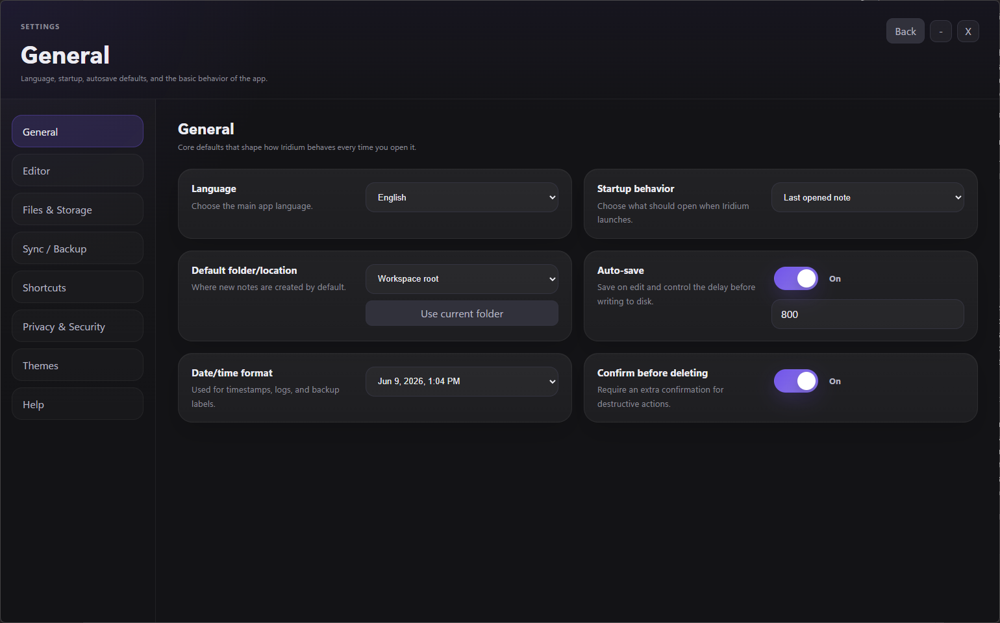
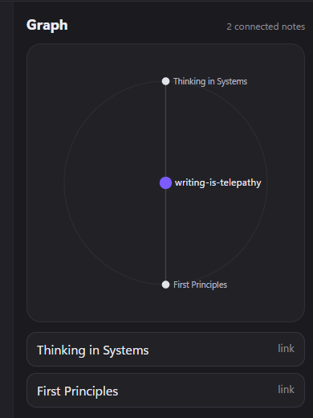

# Iridium

  

  A local-first desktop note-taking app for people who want the flexibility of Markdown,
  the structure of folders, and the speed of an offline knowledge base.

  
  
  
  
  

## What Is Iridium?

Iridium is a desktop knowledge and note-taking app inspired by the local-first workflow people love in tools like Obsidian, but built as its own product and brand.

Your notes live as plain local Markdown files on your machine. No internet connection is required, no account is required, and no cloud service is required to use the app.

## Why Use It?

- Your notes stay on your machine as real files you control.
- It works offline by default.
- It is fast to write in and easy to organize with folders.
- You can connect notes using wiki-style `[[links]]`.
- You get a live graph view for relationships between notes.
- It includes themes, onboarding, settings, and a proper Windows installer.

## Features

- Local-first desktop app
- Plain Markdown notes
- Folder-based organization
- Drag-and-drop note organization
- Autosave
- Backlinks and wiki-style linking
- Live note graph
- Search and bulk note actions
- Themes: Midnight, Dark, and Light
- Guided in-app tutorial
- Windows installer with configurable install path

## Download

Download the latest installer from:

**https://github.com/NaoWasTaken/Iridium/releases**

The packaged installer is named:

`Iridium_Setup_X.X.X.exe` for Windows\
`Iridium_Setup_X.X.X.dmg` for Mac

## Screenshots

All screenshots below use intentionally fake demo content created for the README.

### Workspace

### Settings

### Graph

## How To Use

1. Install Iridium from the Releases page.
2. Launch the app and choose whether to run the tutorial.
3. Create folders for topics, projects, or areas of life.
4. Create notes inside those folders.
5. Write in Markdown and use `[[Note Name]]` to link notes together.
6. Use the graph to explore relationships between notes.
7. Open Settings to change themes, editor behavior, backups, and shortcuts.

## Who It Is For

Iridium is a good fit if you want:

- personal knowledge management
- writing and research notes
- project documentation
- journaling
- a local alternative to cloud-first note apps

## Built With

- Electron
- React
- TypeScript
- Vite
- CodeMirror 6

## Project Goals

Iridium is built around a few core ideas:

- local-first by default
- clean, modern desktop UX
- real files instead of locked-in storage
- fast writing with low friction
- visual note relationships without needing the internet

## Releases

All downloadable builds are published here:

**https://github.com/naowastaken/iridium/releases**

## Author

Built by **naowastaken**.
